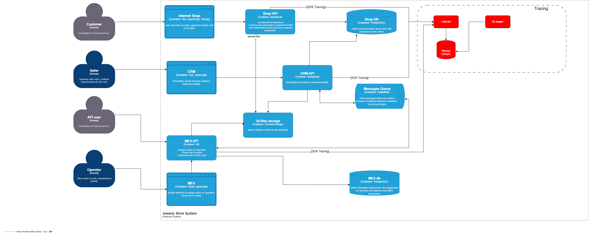
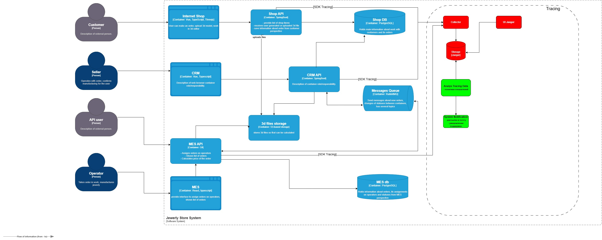

## Трейсинг систем
- заказы 
  - Цель: выявление ошибок в пути одного заказа ("пропажа" данных) между системами
  - Системы: Shop API, MES API, RabbitMQ, CRM API
    - Shop API
      - критические точки:
        - создание заказа -"SUBMITTED"
        - загрузка файла с моделью -"FILE_UPLOADED"
      - обоснование:
        - подтверждение создание заказа и отправка события дальше
        - убеждение создания файла модели
    - MES API
      - критические точки:
        - расчет стоимости "PRICE_CALCULATED" 
        - взятие в работу заказа - "MANUFACTURING_STARTED"
      - обоснование:
        - определить обрабатывается я ли заказ во время расчета
        - подтверждение обработки заказа оператором
    - CRM API
      - критические точки:
        - подтверждение заказа - "MANUFACTURING_APPROVED"
        - отправка заказа покупателю - "SHIPPED"
      - обоснование:
        - последний этап жизненного цикла заказа
    - RabbitMQ
      - критические точки:
        - сообщения не доставлены, обработано частично
        - дубликаты сообщений

- Дашборд
  - цель: выявление технических проблем дашбордов
  - ситемы: MES API, MES DB
    - MES API, MES DB
      - критические точки:
        - запросы к БД
        - выдача, агрегация данных
      - обоснование:
        - выявление тжелых запросов
        - некорректные индексы в таблицах

## Данные для трейсинга
- в каждый трейсинг заказа добавляем данные:
  - orderID - индетификтаор заказа - единый
  - traceId - индетификтаор процесса - единый для всех систем на протяжении цикла
  - spanId - индетификтаор внутреннего шага
  - orderStatus - состояние статуса заказа (меняется для каждой системы)
  - orderSource - источник заказа
  - serviceName - наименование системы
  - operation - выполнение метода (операции)
  - duration - время выполнения операции в мс
  - result - выходные данные операции
  - error - данные ошибки

## Мотивация
- что получит компания:
  - на сегодняшний день компания узнает, что заказ потерялся извне от клиента
  - предотвращение потери заказов и прибыли
  - выявления сбоя жизненнего цикла заказа 
    - прозрачность, место нахождения заказа
    - снижение времени восстановления

- метрики
  - Количество потерянных заказов от общего числа
  - время важных операций
    - расчет стоимости, загрузка дашбордов
  - ошибка шины данных
    - ошибки взаимодействия между системами
  - количество жалоб
    - эффект от внедрения трейсинга 

## Предлагаемые решения
- диаграмма доработок (красный цвет)
  - [sprint_6_arch_tracing.drawio.xml](sprint_6_arch_tracing.drawio.xml)
  - 
- идея: каждая система на жизненном цикле заказа заносит данные по своим операция, вся цепочка действий агрегируется по единому traceId
- компоненты:
  - OpenTelemetry (OTel) - стандарт сбора данных
  - Jaeger - инструмент трейсинга сбор и визуализация

## Компромиссы
- трейсинг не замена мониторингу
  - мониторинг - слежение, обнаружение
  - трейсинг - расследование
- логирование системами данных в своем контексте
- выделение части трейсинга - политика использования
  - ибо хранение обойдется в лишние траты

## Безопасность
- не использовать никаких персональных данных в трейсинге
- политики доступа к трейсинговым данным
  - на уровне отображения
  - на уровне хранения

## Дополнительно Предлагаемое решение
- диаграмма доработок (зеленый цвет)
  - [sprint_6_arch_tracing.drawio.xml](sprint_6_arch_tracing_analys.drawio.xml)
  - 
- идея: ввести временные показатели для операций трейсинга
- правило:
  - операция MANUFACTURING_APPROVED - MANUFACTURING_STARTED - время 1 день
- реализация:
  - из трейсинга анализируем врем "перехода" между статусами
  - создание алерта, тикета, уведомление поддержки
  

### Практика Трейсинг
- 