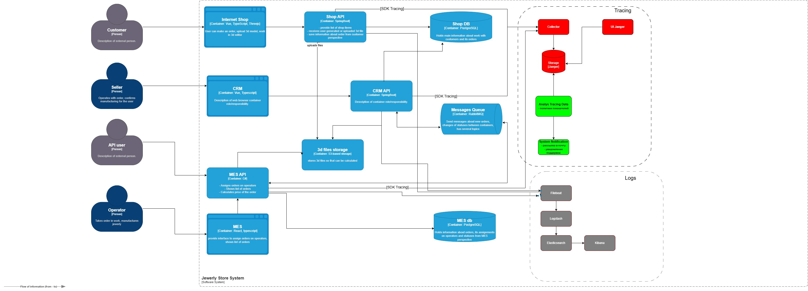

## Логирование

## Анализ планирования логов
- аутентификация
  - операции:
    - вход, выход клиентов, операторов
    - создание, изменение, удаление пользовательских данных
  - системы: Shop API, MES API, CRM API
- заказы
  - операции:
    - факт создания, завершения заказа
    - изменение статусов
  - системы
    - ручки запросов создания заказов
    
- уровни логов
  - INFO события по жизненному циклу заказа
    - обязательные поля
      - service, operation, level, timestamp, traceID, orderID
    - INFO события жизненного цикла заказа
      - INITIATED - Shop API, создание заказа
        - дополнительные поля
          - orderSource, userID
      - FILE_UPLOADED - Shop API, загрузка файла с 3D-моделью
        - дополнительные поля
          - fileID
      - SUBMITTED - Shop API, сделать заказ
        - дополнительные поля - не требуется
      - PRICE_CALCULATED - MES API, расчет стоимости завершен
        - дополнительные поля
          - duration, resultData
      - MANUFACTURING_APPROVED - CRM API, подтверждение заказа
        - дополнительные поля
          - fromStatus, toStatus
      - MANUFACTURING_STARTED - MES API, заказ взят в работу производством
         - дополнительные поля
           - fromStatus, toStatus
      - MANUFACTURING_COMPLETED - MES API, заказ выполнен производством
        - дополнительные поля
          - duration, fromStatus, toStatus
      - PACKAGING - MES API, заказ упаковывается
        - дополнительные поля
          - дополнительные, toStatus
      - SHIPPED - MES API, заказ отправлен покупателю
        - дополнительные поля
          - fromStatus, toStatus
      - CLOSED - CRM API, заказ завершен
        - дополнительные поля
          - fromStatus, toStatus
    
  - ERROR
    - для фиксации критических ошибок
      - обязательные поля
          - service
          - operation
          - level
          - errorMessage
          - errorType
          - timestamp
  - WARN
    - неудачные попытки входа, запрос данных не по уровню
    - обязательные поля
        - service
        - operation
        - level
        - message
        - timestamp

## Мотивация
- что получит компания:
  - на сегодняшний день компания узнает, что заказ потерялся извне от клиента
  - предотвращение потери заказов и прибыли
  - быстрый разбор выявленных ошибок
  - поиск аномалий в бизнес-процессах систем
  - подтверждение операций (создание, удаление, изменение)
  -

- метрики:
  - количество жалоб (обращений) в техподдержку
  - время восстановления после выявления проблем 
  - количество заказов с ошибками
  - количество ошибок взаимодействия между системами

- приоритет на внедрение в первую очередь
  - Shop API - начальная точка создания заказа
  - MES API - RabbitMQ - CRM API - основная проблема ошибок в жизненном цикле заказов 

## Предлагаемое решение
- диаграмма доработок
  - [sprint_6_arch_tracing_analys.drawio.xml](sprint_6_arch_tracing_analys.drawio.xml)
  - 
- идея: единые поля в данных, структурированные JSON логи из всех API, единое место сбора и хранения
- компоненты:
  - Filebeat - агент в сервисе собирает и отправляет логи
  - Logstash - конвейер данных, получает от агента
  - Elasticsearch - БД для хранения логов
  - Kibana - UI логов

- политика безопасности
  - не использовать никаких персональных данных в логах
  - политики доступа к данным логам
    - отсутствие публичного доступа, только корпоративная сеть,  к логам
    - использование ролей - чтение, саппорт, админ
  - маскирование и редакция чувствительных данных
    - обе операции перед отправкой в Logstash
    - маскировка: частичная или хеш - email, телефоны, платежные поля (vo****@ya.ru)
    - редакция: использование whitelist - разрешенные поля (нельзя платежные, паспортные)
  - аудит доступа
    - логирование всех операций, связанных с доступом

- политика хранения логов
  - раздельные индексы для каждой системы
  - объем данных
    - инфо 30 суток,
    - критические - полгода

## Мероприятия для превращения системы логов в систему анализа логов
- критические ошибки
  - резкий рост ERROR в MES, Shop, CRM
  - рост задержек ответов операций
  - задержка времени статуса заказа
  - резкий рост запросов создания заказов
    - возможно DDOS-атака, либо система партнера работает некорректно и шлет "шторм" данных

- аномалии
  - резкий рост ошибок от одного продавца
    - возможно поломка интеграции 

## Критерии выбора технологий
|    **Критерий**    | **ELK**                                  | **OpenSearch**               | **Splunk**                                                |
|:------------------:|:-----------------------------------------|:-----------------------------|:----------------------------------------------------------|
|     Стоимость      | Основное бесплатно, расширения за деньги | Бесплатно, платим за ресурсы | Стоимость насчитывается по объему логов                   |
| Производительность | Высокая (сырые данные + доп поля)        | Примерно как у ELK           | Очень высокая (только сырые, доп данные в процессе поиска |
|  Масштабируемость  | Горизонтальная, расширения за деньги     | Горизонтальная               | Высокая, но платная                                       |
| Скорость внедрения | Средняя                                  | Средняя                      | Низкая                                                    |
