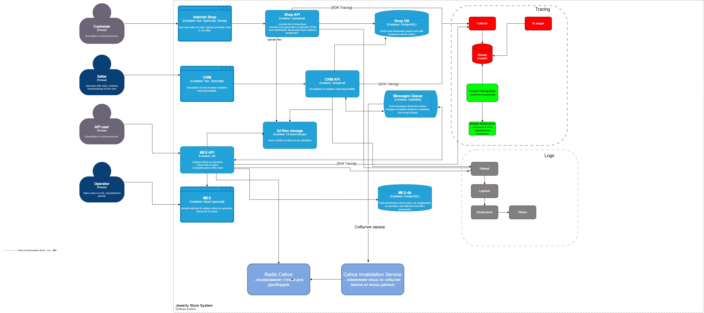

## Кеширование
- проблема - сервис MES: низкая скорость, невыполнение заказов
- цель - ускорить чтение списка заказов, частых данных

## Анализ диаграммы 
- узкие места
  - Mes API и MES DB  
    - тяжелые запросы
    - агрегация данных в дашборд
  - Запросы чтения списка заказов
  - Потеря, искажение данных в шине данных RabbitMq
- кешируем
  - данные при чтении для дашбордов
    - готовые агрегации - в работе, подтверждение, просрочено
    - списки с фильтрами по статусу/дате
  - 

## Мотивация
- облегчить нагрузку на MES
- ускорить чтение данных, уменьшить время доставки данных оператору
- включаем данные
  - серверный кеш - дашборд, списки

## Предлагаемые решения
- серверное
  - данные динамические, поэтому должны быть актуальны
- клиентское - опционально
  - не повлияет, так как он нужен для статики

- выбор паттерна
  - Cache-Aside
    - обоснование
      - легкая интеграция в текущую версиб
      - хранит готовые агрегации а не модель из бд
      - независимость от кеша (на начальном этапе не усложняем, чтобы не поломать, вместо улучшения)
- почему остальные меене подходящие
  - Write-Through - нагрузка останется прежней, так как у нас данные постоянно меняющиеся, кеш постоянно будет меняться, только ухудшим 
  - Refresh-Ahead - возможно в будущем, сейчас нужно быстро и по делу, этот сложный механизм обновления кеша

- инвалидация кеша 
  - по ключу - статус заказа - меняем связанные спискм
  - TTL срок хранения
    - короткий 4-5 минут для списков заказов
    - если заказ потерялся (не будет смены статуса, и заказ вечно останется в кеше), он будет удален по истечении времени
  

- какой и почему паттерн бек-эсайд или еще чтото
- диаграмма
- стратегия инфалидации кеша котрую испльзуем
- таблица сравнительного анализа решений

| **Критерий** | **Cache-aside & TTL**                | **Cache-aside & TTL & инвалидация по событиям**                           | 
|:------------:|:-------------------------------------|:--------------------------------------------------------------------------|
| кратко суть  | кеш при чтении, протухает по времени | кеш при чтении, самообновление при смене статусов, и протухает по времени | 
| особенности  | простая интеграция                   | сложнее, но данные более актуальны                                        |
|    плюсы     | простая интеграция                   | быстрее отдача данных, точнее данные                                      |
|    минусы    | искаженные данные раньше TTL         | требует продуманной схма                                                  |

- не смотря на минусы, выбираем Cache-aside & TTL & инвалидация по событиям
  - нам важнее скорость и актуальность

## Диаграмма последовательностей
- диаграмма
  - [sprint_6_arch_cache.drawio.xml](sprint_6_arch_cache.drawio.xml)
  - 
- процесс запроса списка заказа
  - участники: интерфейс MES, MES API, Redis, MES DB
    - оператор -> интерфейс MES -> MES API - HTTP GET /orders
      - MES API -> обращение в кеш по ключу order:list
      - Rediska
        - если hit - есть уже возращаем ответ
        - если miss - промах
          - MES API -> запрос в БД -> Агрегация -> запись в кеш -> Возрат ответа оператору 

- процесс изменения статуса заказа
  - участники: сервис (MES API, CRM API), RabbitMQ, Redis, MES DB, подписчик(consumer) на статусы Cahce Invalidation Service
  - сервис меняет статус -> посылает в RabbitMQ -> consumer изменяет, удаляет данные из Redis
