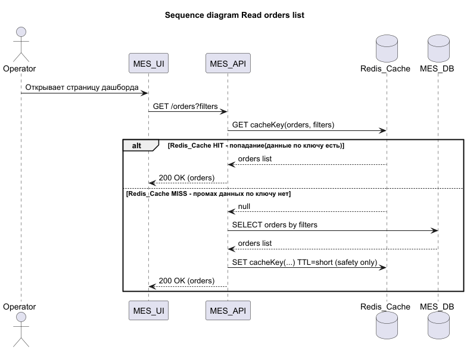
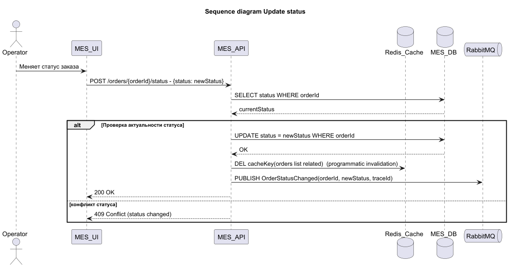
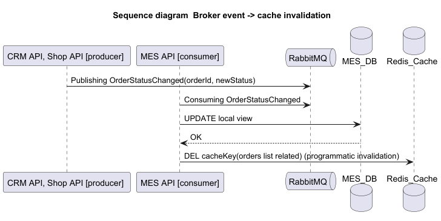

## Кеширование
- проблема - сервис MES: низкая скорость, невыполнение заказов
- цель - ускорить чтение списка заказов, частых данных

## Анализ диаграммы 
- узкие места
  - Mes API и MES DB  
    - тяжелые запросы
    - агрегация данных в дашборд
  - Запросы чтения списка заказов
  - Потеря, искажение данных в шине данных RabbitMq
- кешируем
  - данные при чтении для дашбордов
    - готовые агрегации - в работе, подтверждение, просрочено
    - списки с фильтрами по статусу/дате
  - 

## Мотивация
- облегчить нагрузку на MES
- ускорить чтение данных, уменьшить время доставки данных оператору
- включаем данные
  - серверный кеш - дашборд, списки

## Предлагаемые решения
- серверное
  - данные динамические, поэтому должны быть актуальны
- клиентское - опционально
  - не повлияет, так как он нужен для статики

- выбор паттерна
  - Cache-Aside
    - обоснование
      - легкая интеграция в текущую версию
      - хранит готовые агрегации, а не модель из бд
      - независимость от кеша (на начальном этапе не усложняем, чтобы не поломать, вместо улучшения)
- почему остальные менее подходящие
  - Write-Through - нагрузка останется прежней, так как у нас данные постоянно меняющиеся, кеш постоянно будет меняться, только ухудшим 
  - Refresh-Ahead - возможно в будущем, сейчас нужно быстро и по делу, этот сложный механизм обновления кеша

- инвалидация кеша 
  - по ключу - статус заказа - меняем связанные списки
  - TTL срок хранения
    - короткий 4-5 минут для списков заказов
    - если заказ потерялся (не будет смены статуса, и заказ вечно останется в кеше), он будет удален по истечении времени
  

- таблица сравнительного анализа решений

| **Критерий** | **Cache-aside & TTL**                | **Cache-aside & TTL & инвалидация по событиям**                           | 
|:------------:|:-------------------------------------|:--------------------------------------------------------------------------|
| кратко суть  | кеш при чтении, протухает по времени | кеш при чтении, самообновление при смене статусов, и протухает по времени | 
| особенности  | простая интеграция                   | сложнее, но данные более актуальны                                        |
|    плюсы     | простая интеграция                   | быстрее отдача данных, точнее данные                                      |
|    минусы    | искаженные данные раньше TTL         | требует продуманной схема                                                 |

## Стратегия инвалидации 
  - механизм: программная и событийная
  - дополнительно:
    - TTL используется только как предохранитель, удаляет "мусор"
    - кеш очищается при изменении заказа

## Диаграмма последовательностей
- архитектурная диаграмма кеширования
  - [sprint_6_arch_cache.drawio.xml](sprint_6_arch_cache.drawio.xml)
  - 

- диаграммы последовательностей
  - запрос дашборда с заказами
    - файлы:
      - 
      - [sequence_diagram.read_orders_list.plantuml](sequence_diagram.read_orders_list.plantuml)
    - описание:
      - Пользователь открывает страницу дашборда MES_UI
      - MES_UI - делает запрос в MES_API
      - MES_API - делает запрос в Redis
        - HIT - данные в кеше есть, MES_API возвращает данные в MES_UI
        - MISS - данных в кеше нет
          - MES_API делает запрос в БД
          - MES_API сохраняет в кеше
          - MES_API отдает данные MES_UI
          
  - изменение статуса
    - файлы:
      - [sequence_diagram.update_status.plantuml](sequence_diagram.update_status.plantuml)
      - 
    - описание
      - Оператор делает изменение статуса в MES_UI
      - MES_UI - делает запрос в MES_API
      - MES_API - получает из БД статус заказа
      - MES_API - проверяет актуальность статуса
        - успешно - обновление в БД, инвалидация кеша, публикация в RabbitMQ, возвращение ответа на запрос со HTTP-статусом 200 ОК в MES_UI
        - конфликт - возвращение в MES_UI ответа с HTTP-статусом 409 Conflict Error
  
  - обработка события из брокера
    - файлы:
      - [sequence_diagram.event_processing_from_broker.plantuml](sequence_diagram.event_processing_from_broker.plantuml)
      - 
    - описание
      - Система (CRM API, Shop API) публикует в RabbitMQ сообщение об изменении статуса заказа
      - MES_API - подписан на эти события, и получает сообщения
      - MES_API - обновляет данные в своей БД, так как хранит данные для дашбордов
        - инвалидация кеша
