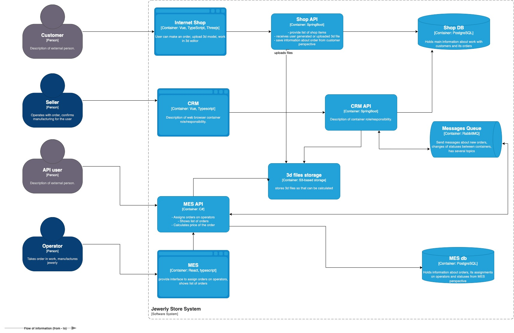

## Компания "Александрит"
- ювелирная компания с производством на заказ
- CRM для клиентов
- MES для производства - теперь свой исходный (выкупила)
  - расчет стоимости производства изделия
  - на первой странице список заказов в работе по статусам
    - дашборд с фильтрами
- CRM и MES общаются через RabbitMQ (реализовано своими силами)
- API для других продавцов ювелирных изделий (MES также делает расчет)
  - MES сообщает через RabbitMQ в CRM о новом заказе

## Проблемки
- растет нагрузка на заказы
- проблемы с заказами
  - клиенты не получают заказов в течение нескольких месяцев
  - при этом мощностей производства хватает даже в х2
- после открытия API для других продавцов 
  - представители компаний жалуется, что не получают заказов
  - операторы жалуются что первая страница MES долго грузится
    - пагинация и фильтр по статусам не помогает 
  - через месяц - потеря нескольких крупных контрактов из-за проблем с заказами
  - недовольство B2C (онлайн магаз) растет
- задержки релиза после тестов, все больше и больше

## Архитектура
- Онлайн-магазин - Vue, Java Spring Boot
- CRM - SPA Vue, Java Spring Boot
- MES - SPA React, C#
- схема текущей архитектуры
  - 
- окружения - dev, release, prod
  - каждый интсанс в облаке как EC2
  - БД Managed services Yandex Cloud - по одному инстансу на запись и чтение
- CI/CD реализован так:
  - Деплой в dev-окружение  автоматически (мёрдж пул-реквеста и юнит-тесты).
  - release - вручную.
  - prod - вручную.
- 2-х недельные спринты по выпуску
  - тестовое окружение - QA гоняет E2E руками
    - обнаружил баги HIGH, HIGHEST, версию не деплоят - на доработку
    

## Команда
- технари
  - фронт - два, стек основной Vue, React знает один частично
  - бэк - два Java, один C#
  - QA - один ручной, хочет автоматизацию
  - тимлид - бывалый C#
  - продакт-манагер - бизнес & поддержка ПО
  - DevOps - один
- бизнесовые
  - продавцы - пользователи CRM
  - операторы - пользователи MES
  - Админы - продакт-манагер, тимлид, менеджеры по продажам
- > Наем в компании активный - можно набрать обоснованно